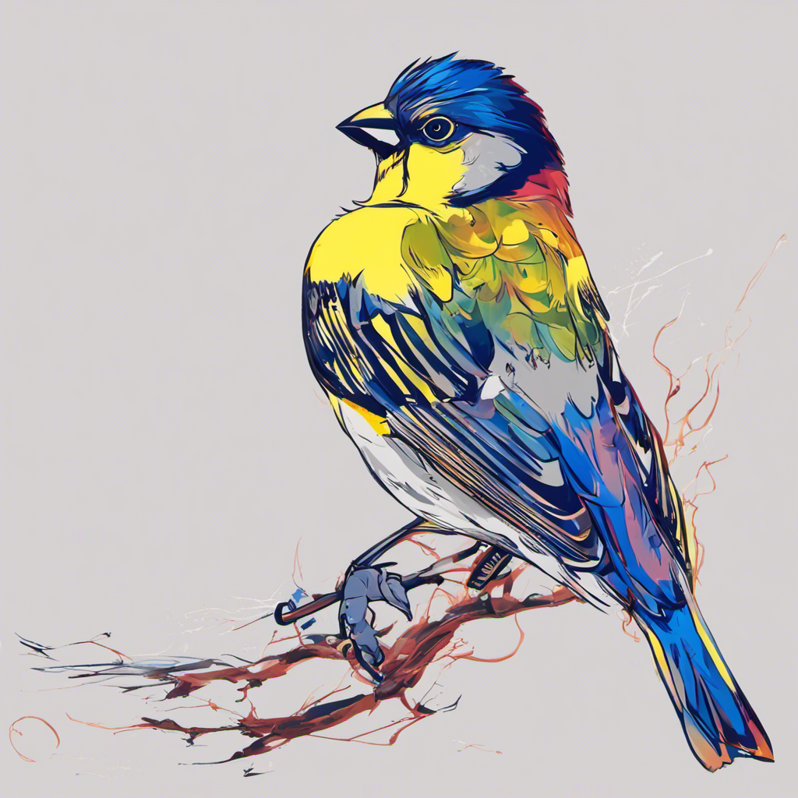

.. finchfs documentation master file, created by
   sphinx-quickstart on Fri Oct  6 11:50:32 2023.
   You can adapt this file completely to your liking, but it should at least
   contain the root `toctree` directive.

FINCHFS: ad hoc parallel file system for HPC
============================================

This image is a finch generated by stable diffusion.

.. toctree::
   :maxdepth: 2
   :caption: User Guide:

   overview
   build
   run
   api
