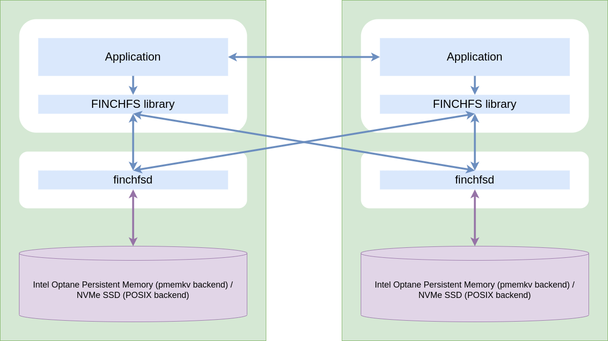

========
Overview
========

FINCHFS is an ad hoc parallel file system for HPC based on the design of `CHFS <https://github.com/otatebe/chfs>`_.

FINCHFS is a user-level parallel ad hoc file system, so it has the following features:

* It is easy to install and use. It does not require root privileges.
* FINCHFS can only be accessed from the FINCHFS client library.
* When the HPC job ends, the server shuts down and the saved data is lost.

FINCHFS also has the following features:

* It is not a POSIX-compliant file system. It does not support file locking, file truncate, etc.
* FINCHFS uses NVMe SSD via POSIX API.

